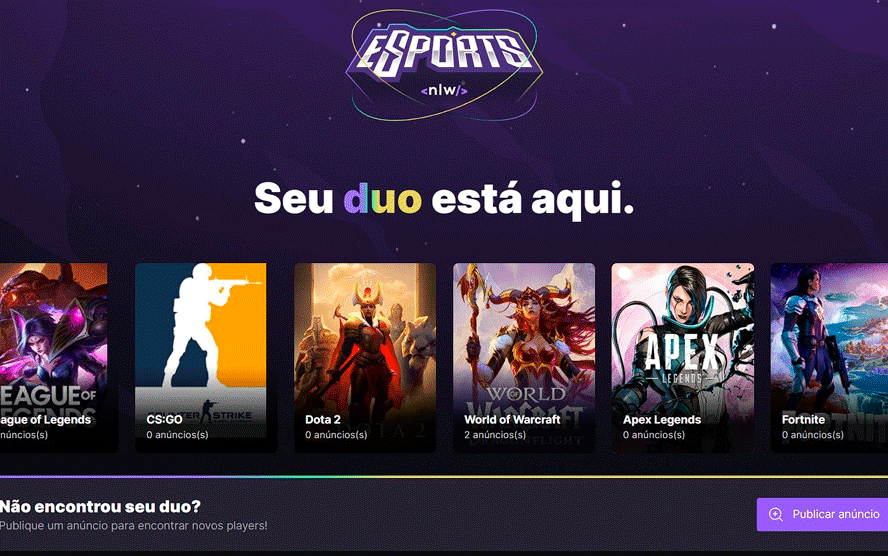
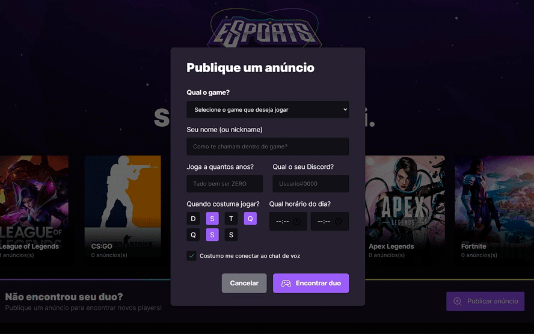
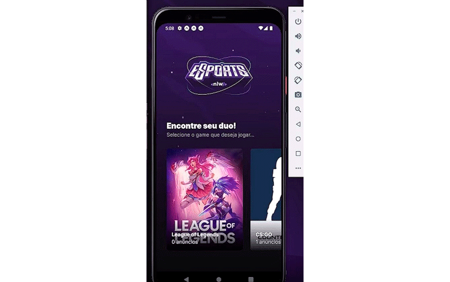
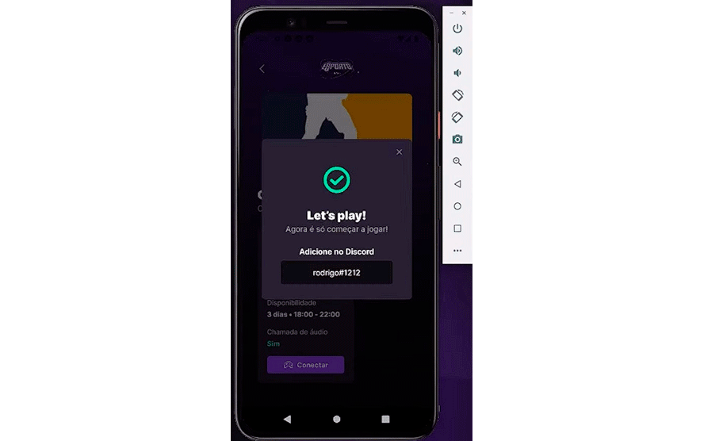

<h1 align="center">NWL eSports</h1>

Desafio, feito junto aos professores durante a semana do NWL.

  <a href="#-tecnologias">Tecnologias</a>&nbsp;&nbsp;&nbsp;|&nbsp;&nbsp;&nbsp;
  <a href="#-projeto">Projeto</a>&nbsp;&nbsp;&nbsp;|&nbsp;&nbsp;&nbsp;
  <a href="#-layout">Layout</a>&nbsp;&nbsp;&nbsp;|&nbsp;&nbsp;&nbsp;
  <a href="#memo-licença">Licença</a>

  

 

  

  

  

  

## 🚀 Tecnologias

Esse projeto foi desenvolvido com as seguintes tecnologias:

- HTML e CSS
- React
- JSON
- React Native
- Expo
- Yarn
- Babel
- Prisma
- Cors
- Express
- Tailwind
- Radix-ui
- Axios
- Phosphor-React
- TypeScript
- [Node e NPM](https://nodejs.org/)
- [Vite](https://vitejs.dev/)

## 💻 Projeto
A parte web foi desenvolvida para que o usuário consiga cadastrar o seu anúncio na API, para que os outros o encontre.
A parte mobile foi desenvolvido para que o usuário consiga ver os anúncios e se conectar ao outro usuário via Discord.
E o servidor faz a integração com as duas partes. 

## 🔖 Layout

Você pode visualizar o layout do projeto através [DESSE LINK](https://www.figma.com/file/x2NKhOdjxO5velmUINNKYg/NLW-eSports-(Community)?node-id=0%3A1&t=LQDPM7XwfOcCvBnn-0). É necessário ter conta no [Figma](https://figma.com) para acessá-lo.

## :memo: Licença

Esse projeto está sob a licença MIT.
